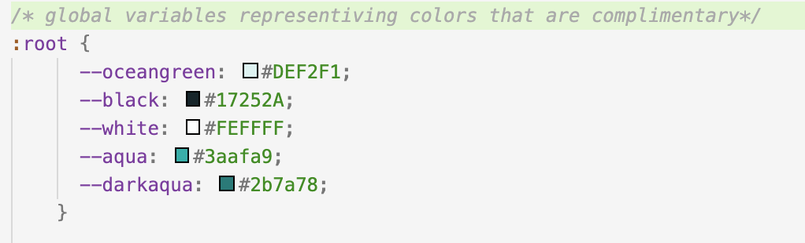
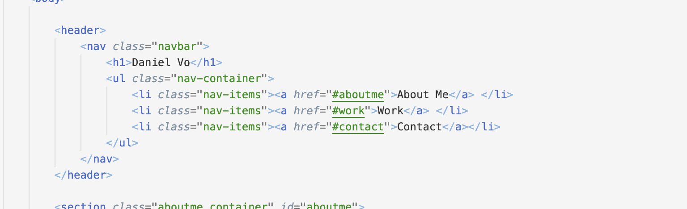
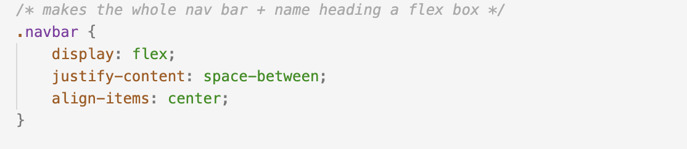
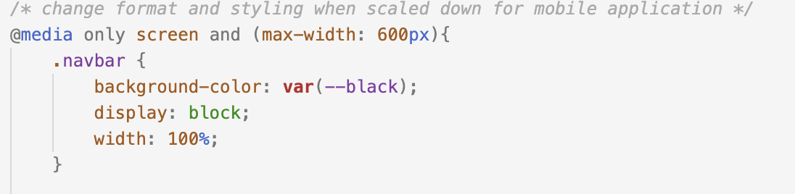

# My Portfolio
I was tasked to make a responsive portfolio webpage that will contain links to my work as well as my contact information. 

## Getting Started

For this project I was given no start code. In order to start the project I created a repository in github that had a README starter file. After cloning it down into my local machine I began to code my webpage. 

### Coding Process 

I began by creating all my starter files. I created my index.html, along with a style css and a reset css. I also called each file within my main html file. I began my project by just coding the bare html. Then returning to add additional styling. 
For my styling I initiated five global variables that all signified their respective colors. The colors were the main palette for the website. I first tackled the navigational bar. I created the nav bar using flex box styling over an unordered list.  

Furthermore, it is also linked to the corresponding section within the webpage. This is done by creating an anchor tag for each list element and have it point to the section's id attribute. After, I created a photo gallery. Using flexboxes and media tags I was able to change the sizes of the images and text to scale with the different window sizes.  Additionally, the images had nested links that would navigate the user to a different website, where the application that was being showcased, would be deployed. Furthermore, when the display was scaled down the projects would stack on top. Finally, I added a footer that had all my contact information. Each link would navigate the user to some other site with my information. 

## Built With

* [HTML](https://developer.mozilla.org/en-US/docs/Web/HTML)
* [CSS](https://developer.mozilla.org/en-US/docs/Web/CSS)

## Deployed Link

* [Live Site] (https://danielvo1.github.io/daniels_portfolio/)

## Authors

* **Daniel Vo** 

- [Link to Portfolio Site](https://danielvo1.github.io/daniels_portfolio/)
- [Link to Github](https://github.com/)

See also the list of [contributors](https://github.com/your/project/contributors) who participated in this project.

## Tools and References 

- [Link to Flexbox Cheat Sheet] (https://css-tricks.com/snippets/css/a-guide-to-flexbox/)
- [Link to W3 Schools] (https://www.w3schools.com/)
- [Link to Reset CSS file] (https://meyerweb.com/eric/tools/css/reset/)